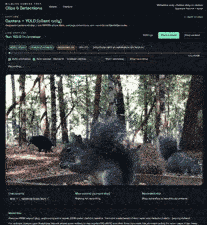

# Wildlife Camera-Trap System

An end-to-end AI system for detecting and recording wildlife. Supports training custom models, running inference on edge devices (Python) or directly in the browser (Web), and managing clips via a modern dashboard.



## Project Structure

```
.
├── infra/
│   ├── supabase_schema.sql        # Database schema (clips table + indexes + RLS)
│   └── .env.example               # Supabase keys template
├── notebook/                      # Model Training
│   └── wildlife_yolov8_pipeline.ipynb # End-to-end YOLOv8 training & export pipeline
├── edge/                          # Python Capture App (Dedicated Hardware)
│   ├── config.example.yaml        # Capture settings (camera, model, thresholds)
│   ├── main.py                    # Orchestrates capture loop
│   ├── detection.py               # YOLOv8 (PyTorch) wrapper
│   ├── recorder.py                # Video recording & file management
│   └── supabase_client.py         # Uploads metadata & thumbnails
└── web/                           # Next.js Web App (Dashboard + Browser Capture)
    ├── public/models/             # ONNX models & labels for browser inference
    ├── src/app/
    │   ├── page.tsx               # Dashboard (Clip List)
    │   └── capture/page.tsx       # In-Browser Capture Page
    ├── src/components/
    │   └── CameraCapture.tsx      # ONNX Runtime Web implementation
    └── src/lib/modelConfig.ts     # Browser model configuration
```

## 1. Notebook (Training & Export)

Located in `notebook/wildlife_yolov8_pipeline.ipynb`.
- **Purpose**: Train YOLOv8 models on wildlife datasets (e.g., ENA24, LILA BC).
- **Features**:
  - Dataset download and formatting.
  - Model training (YOLOv8n/s/m).
  - Evaluation and visualization.
  - **Export to ONNX**: Converts trained models to `.onnx` format for use in the Web App.

## 2. Web App (Dashboard + Browser Capture)

A Next.js application.

### Features
- **Dashboard**: Browse, filter, and watch recorded clips stored in Supabase.
- **In-Browser Capture** (`/capture`): 
  - Turns any laptop or phone into a camera trap.
  - Runs **YOLOv8 via ONNX Runtime Web** directly in the browser (Client-side only).
  - Detects animals, auto-records clips, and uploads them to Supabase.
  - Configurable models (e.g., `my-ena24.onnx`, `MDV6-yolov10-c.onnx`) in `public/models`.

### Setup
1. `cd web`
2. `cp .env.example .env.local` and fill in Supabase credentials.
3. `npm install`
4. `npm run dev` -> Open `http://localhost:3000`

## 3. Edge App (Python Capture)

A lightweight Python application designed for dedicated edge devices (Raspberry Pi, Jetson, Laptop).

### Features
- Runs **YOLOv8 (PyTorch)** for high-performance inference.
- Connects to USB webcams or RTSP streams.
- Records `.mp4` clips locally and syncs metadata/thumbnails to Supabase.
- Supports offline operation (uploads when internet is available).
- Notifications via Telegram or Discord.

### Setup
1. `cd edge`
2. `cp config.example.yaml config.yaml` (Edit settings: camera source, model path, etc.)
3. `cp .env.example .env` (Add Supabase & Notification keys)
4. `pip install -r requirements.txt`
5. `python main.py --config config.yaml`

## Supabase Setup (Backend)

1. Create a Supabase project.
2. Run `infra/supabase_schema.sql` in the SQL Editor to create the `clips` table and policies.
3. Create a public storage bucket named `thumbnails`.
4. Get your URL and Keys (Anon Key for Web, Service Role Key for Edge/Admin).

## Quick Start

**To run the Web Dashboard & Browser Capture:**
```bash
cd web
npm install
npm run dev
# Visit http://localhost:3000/capture to try the camera
```

**To run the Python Edge Capture:**
```bash
cd edge
pip install -r requirements.txt
python main.py --config config.yaml
```
